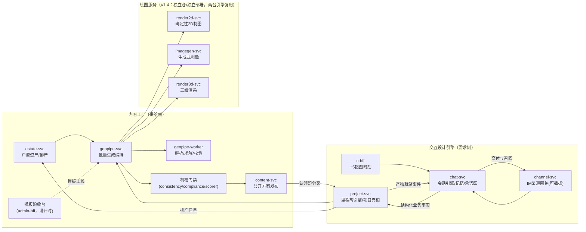

# 《是我的家》架构对齐文档：设计 Agent 方案 × 技术架构方案

> 版本：V1.6（**V1.6 裁决（2026-09-04）：渲染两档合为一档**，见 §3.1；写实化模型选型（§382 待定项）调研收官＝控制图通路，见《评审/控制图通路调研-2026-09-02.md》；V1.1 增补决策五：IM 主通道与可插拔渠道层，首发飞书；V1.2 增补决策六：第一阶段视觉模板体系融合；**V1.3 裁决：系统无人工介入环节**——人审门/结构复核/抽检/转人工全部移除，决策三整体重写；设计只面向把系统做好用，不面向责任划分，责任话题以入口服务声明一次性了结，不进入设计讨论；**V1.4 裁决（2026-08-23）：绘图能力物理拆分**——推翻"不新建渲染服务"口径，绘图 activity 按绘图逻辑拆为三个独立服务、独立仓库（render2d / imagegen / render3d），genpipe 保留编排与非绘图 activity，决策二重写；**V1.5 裁决（2026-08-23）：design-svc 一拆为二 + 里程碑引擎事件驱动**——chat-svc（Python 会话引擎）+ project-svc（Java 项目状态机），设计项目长周期 Temporal workflow 作废、Temporal 收缩至任务层，《沟通助手架构方案》v0.3 收录为会话域基线文档，决策一重写。文中未逐处改写的"design-svc"字样按拆分对照理解：会话职责→chat-svc，状态/任务职责→project-svc）
> 日期：2026-08-22
> 输入文档：《装修设计 Agent 架构方案》（现 V1.3，下称 **Agent 方案**）、《AI装修效果图产品·技术架构方案》（下称 **技术架构**）、《第一阶段视觉提案与 Prompt 说明》（下称 **视觉提案**）
> 文档性质：两份基线文档的拼接层。不重复两边已定的内容，只解决"缝"：交互式 Agent 的服务落点、深度设计链路补全、两道门的统一、数据与事件契约映射。
> 结论有效前提：~~技术架构待拍板项①（8-15人、Java+Python 双班底）成立~~（**2026-08-23 拍板**：开发完全由 Claude 承担、语言栈不受班底约束，双栈维持——前提成立，不再是风险项）。

---

## 一、统一产品图景：双引擎，一份供给

两份文档不是竞争关系，是同一产品的两台引擎：

| | 内容工厂引擎（技术架构主描述） | 交互设计引擎（Agent 方案主描述） |
|---|---|---|
| 驱动方 | 排产（estate 交付日历） | 单个用户的设计项目 |
| 生成形态 | 离线批量：多候选→打分→机检门禁→发布 | 在线会话：确认闭环→初步方案→深度设计 |
| 质量门 | 机检门禁（模板于上线时一次性验收） | 用户确认 + 硬证据机检 |
| 产物归属 | 公开内容（content-svc，可被所有命中用户消费） | 私有项目产物（属于单个用户的 ProjectState） |
| 变现挂点 | 引流、认领转化 | 深度设计付费、shelf 单品归因 |

两台引擎在**户型库**处咬合：

```text
内容工厂：estate 户型资产 → genpipe 批量预生成 → 机检门禁 → content 发布
                                                          │
交互引擎：用户命中户型库 ──── 认领即分叉（fork）───────────┘
          → 预生成方案作为 PreliminaryPlan 种子
          → 确认闭环 / Patch / 深度设计（全部发生在用户私有的 ProjectState 上）
          → 交互侧信号回流 estate 排产（哪些户型被请求但库里没有）
```

**对齐原则一：公开内容与私有项目严格分轨。** content-svc 只存通过机检门禁的公开发布物；用户上传的户型、家庭信息、个人方案、私有效果图一律归 design-svc（见下），OSS 走独立私有 bucket + STS 临时凭证，防盗链策略与公开内容不同。用户隐私数据不进入内容工厂。



---

## 二、决策一（V1.5 重写）：交互式设计 Agent = chat-svc + project-svc 两服务

### 2.0 V1.5 裁决：design-svc 一拆为二

原 V1.0–V1.4 口径为单一 design-svc 同时持有会话编排与 ProjectState。**2026-08-23 用户裁决拆分**，判据与绘图拆分（V1.4）同源——逻辑异质必须物理隔离：

- **会话层**：LLM 驱动的模糊逻辑（理解/情绪/记忆/话术），每句话都不一样；
- **项目层**：确定性状态机（里程碑/槽位真相/修订预算），零模型自由度——项目不能被模型"聊丢方向"。

拆分时机：ProjectState 尚未落库（路线图数据层未执行），零迁移成本。会话域机制基线 = **《沟通助手架构方案》v0.3**（同日收录，其三层架构 D8 与本裁决同构；其服务拓扑按本节归位）。

### 2.1 服务定义

| 项 | chat-svc | project-svc |
|---|---|---|
| 名称 | `{code}-chat-svc` | `{code}-project-svc` |
| 职责 | 对话全流程：意图/情绪/槽位与反馈抽取、封闭动作集决策（受当前里程碑裁剪）、产物呈现与反馈映射、记忆三层与画像五区、承诺区、主动消息引擎（现 design-svc Orchestrator v1 演进而来，代码保留） | 项目状态机与里程碑引擎（事件驱动 checkCompletion）、slot/artifact/generation_task/revision 唯一真相、生成任务创建与编排、修订预算判定、流程定义权威分发（process_version 项目创建时固化） |
| 语言 | Python（沿用 aipipe 现 design-svc 代码；LangGraph 静态图 + LiteLLM + Langfuse） | Java/Spring（并入 ishome-backend monorepo） |
| 存储 | PG schema `svc_chat` + Redis 会话态 | PG schema `svc_project` |
| 明确不做 | 不判里程碑、不建生成任务、不持产物本体（只持引用）、无装修领域硬编码（领域知识来自流程定义配置） | 不理解自然语言、不执行生成；**支付与权益不进本服务**（归 trade-svc，资金路径故障域纪律） |

服务存在性判据：chat-svc 继承原 design-svc 的会话式 LLM 负载伸缩轴；project-svc 是业务域标准 CRUD/状态机形态（与 Java 侧同构）；两者故障域隔离——模型抖动不伤项目真相，排产高峰不挤占会话。

**边界一句话：chat-svc 管听懂和说话，project-svc 管事实和规则，genpipe 管编排管线，绘图服务管画图算力。** 链路单向：chat 产出结构化业务事实（slot_filled / artifact_confirmed / feedback_received）→ project-svc 判定并创建任务 → genpipe workflow 派发 worker 与绘图服务 → 产物登记 → 事件 → chat 呈现。**chat 与绘图服务永不直接交互；chat 永不判里程碑。**

### 2.2 概念 → 技术组件映射（V1.5 更新）

| 概念（Agent 方案 / v0.3） | 技术落点 |
|---|---|
| 里程碑状态机（v0.3 §7 / V1.1 Workflow Graph §9） | **project-svc 里程碑引擎：事件驱动，真相在表**——每处理完影响判据的事件并落库后执行 checkCompletion（读判据配置→查 slot/artifact 表→布尔求值→迁移+on_enter 编排）。**V1.5 裁决：原"设计项目=长周期 Temporal workflow（continue-as-new）"方案作废，Temporal 收缩至任务层**（生成管线 workflow/activity，重试/心跳/超时用原生语义）。不搞定时轮询；对话连续性由外置状态承载，不用框架挂起 |
| Design Orchestrator / 会话层轮内工作流（v0.3 §8） | chat-svc 内 LangGraph 静态图：理解（并行）→状态装载→封闭动作集决策→执行（校验回路）→写回投递；LLM 经 **LiteLLM 网关**，观测与成本 = **Langfuse**（不引入 LangSmith） |
| ProjectState（§7） | `svc_project` schema，见 §5.1 表结构 |
| 确认闭环（§8.2） | chat 识别"确认"为业务事实 → artifact_confirmed 事件 → project-svc 落库触发里程碑引擎；认知状态六值沿 contracts 既定（user_confirmed 仅确认闭环授予）+ c-bff 看图点错交互 |
| 结构化 Patch / 修订循环（§11 / v0.3 时序B） | chat 受限映射（修订维度词表枚举校验，LLM 自创值不采纳→追问澄清）→ feedback_received{target, dimension, direction} → project-svc 修订预算判定 → revision task（base 版本参数+指令）→ 增量重算 |
| 流程定义配置（v0.3 D10） | 版本化配置制品归业务域、随 monorepo 评审；project-svc 权威分发（`GET /process-definitions/{version}`）；chat 消费槽位 schema/词表/动作白名单/prompt 片段，project 消费判据/编排/预算；**配置只放数据，逻辑归服务** |
| 交付图集 / 模板库（§4、§10） | genpipe 编排 + 绘图服务 activities（见 §3.1），project-svc 传入版本参数与模板声明，产物注册回 artifact 表 |
| 记忆/画像/承诺区（v0.3 §10-11） | chat-svc：三层记忆（工作/情景 pgvector/语义画像五区）；承诺白名单=自动化能力清单，兑现率恒 100%；**挂任务承诺以任务事件核销，不自扫 deadline**（到期真相在任务层） |
| Scene Graph（§6.3） | `svc_project.scenes`（JSONB）+ OSS 场景包（编译产物，如 glTF），见 §3.2 |

### 2.3 交互通道与延迟形态

**IM 为项目主线程，H5 承接富交互**（详见 §六 决策五）：

- IM 渠道 → channel-svc → chat-svc：会话消息、快速确认、图片上传、文本反馈。**chat 定投递策略（分段/打字延迟/时段调度），channel-svc 按能力声明执行**（quick_reply 降级同理）。
- c-bff（H5）→ chat-svc：看图点错、三图对比标注、材质风格选择、3D 查看等"指图时刻"；产生的业务事实同样发往 project-svc。
- 生成任务：project-svc 创建任务并启动 genpipe Temporal workflow 立即返回；完成事件经 chat 主动消息引擎**直接把图发进聊天线程**（"你的三张方案图好了"），无主动发送窗口时降级为触达级渠道（订阅消息/短信）召回。分钟级异步生成与 IM 的异步消息形态天然匹配，用户无需守在会话里等。
- 失败路径显式（v0.3 §9）：Temporal 重试耗尽 → task_failed 事件 → chat 诚实告知+改期（一次为限）→ 二次失败走边界声明，里程碑不迁移，缺口遥测。任务超时由 Temporal timeout 兜底，无手工 deadline 扫描。

---

## 三、决策二（V1.4 重写）：深度设计链路 = genpipe 编排 + 三个独立绘图服务

### 3.0 V1.4 裁决：绘图能力物理拆分

原 V1.0–V1.3 口径为"不新建渲染服务，绘图全部收进 genpipe-worker"。**2026-08-23 用户裁决推翻**：绘图逻辑完全异质的能力必须物理隔离（独立仓库 + 独立服务）——无物理隔离的模块边界在长期开发中必然腐烂，此为多次验证的历史经验；构建级门禁（package 边界 + import-linter）不作为物理隔离的替代。

拆分粒度按**绘图逻辑/图片特性**分组，组内逻辑同质、跨组逻辑异质：

| 服务 | 仓库 | 承接 activity | 绘图逻辑 | 算力形态 |
|---|---|---|---|---|
| `render2d-svc` | `ishome-render2d` | plan-2d-render | 确定性几何绘制（母版/确认底图/图层/遮罩） | CPU |
| `imagegen-svc` | `ishome-imagegen` | atmosphere-visual、realism-pass | 生成式图像（扩散模型：模板驱动风格化、写实化） | 外部模型 API / GPU 推理 |
| `render3d-svc` | `ishome-render3d` | scene-compile、base-render | 三维场景编译与底渲（几何/深度/线稿/遮罩） | GPU + 三维引擎重依赖 |

服务存在性判据逐服务作答：三者**伸缩轴各自独立**（CPU 批量 / API 配额与 GPU 推理 / GPU 渲染），**故障域独立**（依赖栈互不传染，一类图挂不影响另两类出图），所有权同为 AI 团队但发布节奏随各自技术栈独立。

### 3.1 集成形态与 activity 归属

- **genpipe-svc 职责不变**：Temporal workflow 编排、发布门禁状态机，两台引擎的生成链路仍由 genpipe workflow 串起（上层聚合）。
- **绘图服务 = 独立部署的 Temporal worker 服务**：各自监听专属 task queue（`render2d-activities` / `imagegen-activities` / `render3d-activities`，沿 `genpipe-activities` 既有惯例；权威名单=contracts `registries/task_queues.md`，2026-08-23 深夜落定后本处回改），无对外 RPC 端口、无数据库 schema、无状态（算完即焚，产物写 OSS + 注册 ArtifactRegistry）。重试/心跳/取消/背压沿用 Temporal activity 原生语义，**不引入服务间 HTTP 调用**。
- **genpipe-worker 保留非绘图 activity**：解析、求解、校验、门禁与 3D 资产加工。
- **契约**：绘图 activity 注册名与输入输出 schema 在 ishome-contracts activity 注册表版本化管理（既有机制），跨仓接口变更走 contracts 发版流程。
- 工厂线/交互线**复用同一实现**的原则不变（复用落在服务级）。

| activity | 归属 | 说明 | 两台引擎复用 |
|---|---|---|---|
| floorplan-parse | genpipe-worker | 户型图解析（备用路径） | 工厂建库 / 交互上传，同一实现 |
| plan-layout-solve | genpipe-worker | 自动布局与尺寸计算（确定性求解） | 复用 |
| plan-rule-check | genpipe-worker | 空间规则校验（碰撞/通道/边界闭合） | 复用 |
| plan-2d-render | **render2d-svc** | 母版与确定性图层绘制：确认底图、功能说明图、风格图几何底图；同时输出房间遮罩/墙体图层 | 复用 |
| atmosphere-visual | **imagegen-svc** | 风格化交付图生成（模板库驱动，固定遮罩） | 复用 |
| scene-compile | **render3d-svc** | DeepDesign → Scene Graph → 场景包编译 | 交互引擎专用 |
| base-render | **render3d-svc** | 三维底渲（几何/深度/线稿/遮罩输出） | 交互引擎专用 |
| realism-pass | **imagegen-svc** | 生成式写实化 | 复用（工厂效果图同用） |
| consistency-check | genpipe-worker | 户型与跨视角一致性校验 | 复用 |
| compliance-check | genpipe-worker | 内容安全（既有 stage） | **两条路径都强制**：系统无人审环节，合规机检更不豁免 |

**渲染只有一档（V1.6，2026-09-04 用户裁决"两档位合成一档没有问题"）**：realism-pass 不带档位参数，每张都过门禁。原两档口径留作对照：~~`preview`（快速低质，供会话内迭代和 Patch 后的即时反馈）与 `final`（正式出图）；失效后默认只重算 preview，final 由用户显式请求或交付节点触发~~——其动机是 Seedream 单价 0.60 元、两分半一张；换到控制图通路（万相 0.14 元、20–50 s）后动机消失。成本或延迟数据再出问题时再拆回两档。

### 3.2 场景与产物存储

- Scene Graph 主数据：`svc_design.scenes`，JSONB，绑定 DeepDesign revision。
- 编译场景包 / 底渲控制图 / 效果图：OSS 私有 bucket，key 前缀按 projectId，ArtifactRegistry 记 OSS key + 依赖对象 + revision。
- 效果图对 C 端交付：c-bff 签发 STS/签名 URL，不走 content-svc（分轨原则）。

### 3.3 三维资产库：catalog 模块，暂不成服务

深度设计需要家具/材质三维资产库。按服务存在性判据判：无独立伸缩轴、无独立故障域，所有权（运营维护）可经 admin-bff 覆盖——**不单拆**，落法：

- 逻辑域 `catalog`，物理落 estate-svc（同为供给侧主数据），schema 独立为 `svc_catalog`（拆库不流血纪律）。
- 运营 CRUD 走 RuoYi 代码生成（与小区库、选品池同待遇）。
- 3D 模型加工（格式转换、LOD、缩略图）= genpipe activity，不成服务（对齐技术架构 1.2 媒体处理原则）。
- 资产可选携带 shelf SKU 关联 → 深度设计中确认的家具即单品意图，回流 shelf 归因。**这正是技术架构待拍板③"单品意图数据回流"的最强数据源**：交互深度设计的意图质量远高于内容工厂浏览行为。
- 升格为独立 catalog-svc 的触发条件（写死）：出现专职资产团队，或资产加工管线复杂度需要独立发布节奏。
- 资产**来源**（自建/采购/厂商合作）是产品与 BD 决策，列为新增待拍板项⑦——它决定资产量级和 SKU 关联深度，是深度设计链路的最大外部依赖。

---

## 四、决策三（V1.3 重写）：质量门全机检，人的判断只在设计时

~~原三道门（内容人审 / 结构复核签认 / 交互抽检）设计作废~~——V1.3 裁决系统无人工介入环节。质量保障重排如下：

| 门 | 触发方 | 形态 | 通过动作 |
|---|---|---|---|
| 机检门禁 | genpipe 工厂管线 / design-svc 交互产物 | consistency-check + compliance-check + scorer 阈值，**全自动** | 达标 → 发布/交付；不达标 → 自动重生成或换模板 |
| 用户确认门 | chat 识别确认 → project-svc 落 artifact_confirmed | 用户看图确认（当事人校验，产品流程的一部分） | 事件触发里程碑引擎 checkCompletion → 迁移并执行 on_enter（V1.5：无 workflow signal） |
| 结构门 | design-svc（方案涉及结构改动） | 硬证据机检：户型库结构数据优先，其次用户上传图纸 | 校验通过 → 继续；无证据 → 自动降级为不动结构方案 |
| 模板验收 | 运营上线新模板（**设计时动作，非运行时环节**） | 模板验收台（admin-bff）：样张对比、验收/打回 | 模板发布进模板库 |

规则：**运行时不存在任何人工队列。** 运行时质量信号改为产品内嵌采集（"换一张"点击、确认闭环修正率、投诉回流，落 PostHog/ClickHouse），作为检测器与生成模型迭代的地面真值——机检漏掉的问题，出路是迭代机检，不是加人。

---

## 五、决策四：数据与事件契约映射

### 5.1 项目真相与会话数据表结构（V1.5：svc_design 拆为 svc_project + svc_chat）

```text
# project-svc（Java）—— 项目唯一真相
svc_project.projects           # id, user_id(identity), current_milestone, process_version, status,
                               # 户型引用(estate floorplanId 或私有上传)
svc_project.slots              # 槽位真相：slot_key/value/status(认知状态六值)/source_event_id/confidence/stage
                               # —— 吸收原 svc_design.facts；V1.1 §8.1 JSON 示例直接落列，枚举存字符串
svc_project.artifacts          # ArtifactRegistry：milestone/type/version/storage_url/gen_params/lineage/
                               # status(generated|presented|confirmed|rejected)/viewSpecVersion/dependsOn
svc_project.generation_tasks   # 生成任务业务真相：type/input_snapshot/status/artifact_id
                               # （执行、重试、超时语义在 Temporal，此表只记业务事实）
svc_project.revision_log       # 修订记录：milestone/round_no/directive(结构化)/task_id——修订预算判定依据
svc_project.decisions          # UserDecisions：确认/否决/里程碑进入，含确认事件引用
svc_project.scenes             # Scene Graph JSONB，绑定 deep revision
svc_project.open_questions     # 确认清单与深度提问
svc_project.outbox             # 本地事务 + outbox（对齐 2.6 纪律）

# chat-svc（Python）—— 会话与记忆
svc_chat.conversations / messages   # 会话与消息原文
svc_chat.user_profiles              # 画像五区：事实/偏好/承诺/沟通风格/情绪模式（存模式不存状态）
svc_chat.episodic_memories          # 情景记忆：会话结束触发摘要，结构化表 + pgvector（不用原始聊天记录做 RAG）
svc_chat.commitments                # 承诺区：类型/内容/deadline/履约动作/状态/关联 task_id
                                    # 挂任务承诺以任务事件核销，不自扫 deadline
# 会话态（阶段/情绪轨迹/槽位缓存）在 Redis；槽位真相唯一在 svc_project.slots，chat 仅缓存用于组装上下文
```

主键 ULID、UTC、软删、金额无涉——全部继承技术架构 6.4。画像只存跨项目个人特征，项目档案归 svc_project；一个用户可多项目。

### 5.2 V1.1 事件 → CloudEvents 映射

**纪律：只有业务语义事件上 RocketMQ 总线；编排细节（确认清单生成、缺口分析这类流程内部步骤）留在 Temporal workflow 里，不发总线。** 违反这条，总线会变成 workflow 日志的复读机。

| V1.1 §9.2 事件 | CloudEvents type（`com.{code}.` 前缀省略） | 上总线？ |
|---|---|---|
| PlanUploaded | `design.floorplan.uploaded` | 是 |
| PlanLibraryMatched | `design.floorplan.matched` | 是（estate 命中率指标源） |
| BasicRequirementProvided | — | 否（Temporal 内部） |
| ConfirmationListGenerated | — | 否（Temporal 内部） |
| FactConfirmed / FactCorrected | `design.fact.confirmed` / `design.fact.corrected` | 是（corrected 回流 estate 数据质量） |
| PreliminaryPlanGenerated | `design.plan.revision-created` | 是 |
| PreliminaryPlanAccepted | `design.plan.accepted` | 是（转化漏斗关键点） |
| DeepDesignRequested | `design.project.deep-entered` | 是（付费转化点，trade 关心） |
| DeepDataProvided | — | 否（落 facts 即可） |
| StructuralEvidenceProvided | `design.structure.evidence-provided` | 是（合规审计留痕） |
| DeepDesignConfirmed | `design.deep.confirmed` | 是 |
| RenderGenerated | `design.render.generated` | 是（成本与产能指标源） |
| RenderFeedbackReceived | `design.render.feedback-received` | 是 |
| （新增）户型库未命中 | `design.floorplan.missed` | 是——**estate 排产的需求侧信号**，双引擎咬合点 |

分析链路照旧：consumer 落 ClickHouse，漏斗在 PostHog/Metabase 看。

### 5.3 contracts 仓新增

- `proto/{code}/design/v1/`：design-svc gRPC（会话、确认、Patch、项目查询）。**V1.5 注**：契约域名与 DesignService 入口不动（channel 转发目标即它），部署承接方为 chat-svc；project 域接口（槽位/产物/任务/流程定义分发）是否独立 proto 包，建服务时定〔开放〕。
- OpenAPI：c-bff 新增 design 相关端点（snake_case 端到端纪律不变）。
- 事件 schema：上表 CloudEvents 全部入注册表。
- 错误码域：`DESIGN_xxx`。
- monorepo 变化：`aipipe/` 从 `orchestrator、workers…` 调整为 `services/{genpipe-svc, genpipe-worker, design-svc}` + `packages/{scoring, adapters, patch-engine}`。**V1.4 追加**：绘图 activity 不在 aipipe 内——`ishome-render2d` / `ishome-imagegen` / `ishome-render3d` 三个独立仓库各承载一个绘图服务（见 §三），aipipe 中既有绘图 activity 存根迁出。**V1.5 追加**：aipipe 的 `design-svc` 目录更名 `chat-svc`（Orchestrator 代码保留）；project 域为 Java 服务，落 ishome-backend monorepo 新增 `project-svc` 模块。

---

## 六、决策五：IM 主通道与可插拔渠道层（channel-svc）

### 6.1 通道格局

**IM 做项目主线程，H5 做"指图时刻"，小程序降级为分享卡片与支付容器。** 依据：设计流程本身是跨数周的长对话（召回免费）、生成是分钟级异步（IM 是天然的异步交付介质）、交付图在聊天中送达可被转发进业主群（自带增长循环）。（V1.3：原"设计师可进线程接管"一条删除——系统无转人工。）

交互分界一条规则：**凡是需要"指着图说话"的交互进 H5，凡是"一句话说得清"的交互留 IM。**

| 留在 IM | 跳 H5 |
|---|---|
| 提问与回答、需求收集、户型图上传 | 看图点错确认（V1.1 §8.2） |
| 生成完成通知 + 图片交付 | 交付图对比查看与标注 |
| 是/否、选项类快速确认 | 材质/风格视觉网格选择 |
| 文本反馈（"客厅太挤了"） | 3D 场景查看、效果图大图、支付 |

配套纪律：**每次 H5 交互的结果必须回写一条摘要消息到聊天线程**（"你确认了 12 项、修正了 2 项"），聊天线程始终是用户可见的完整项目时间线，与 RevisionLog 一一对应。

### 6.2 渠道可插拔 = channel-svc（notify-svc 升格，服务数仍 11）

IM 渠道必须多种可插拔。**首发渠道 = 飞书**（设计要点见 §6.7）；微信生态（企微、微信客服、公众号）、抖音/小红书私信、海外 IM 为后续扩展位。落法：

- **notify-svc 升格为 channel-svc**：单向触达（短信、订阅消息）是会话的退化形态（只出不进），不值得双拆——触达级渠道作为 outbound-only adapter 并入同一插件体系。
- channel-svc 职责：渠道适配器插件运行时、统一消息模型、触达策略引擎、渠道身份绑定（协同 identity-svc）、聊天媒体与 OSS 双向中转。
- 网关入口收敛：技术架构 §3.2 入口表中所有 IM webhook（企微/公众号/微信客服/后续渠道）统一 → channel-svc 一个入口，不再散落。

### 6.3 插件契约（按"十年不动摇"标准设计的部分）

**可插拔的关键不是支持多个 IM，而是 design-svc 对渠道零感知。** 靠三样东西：

1. **统一消息模型**（contracts 仓 `channel.v1`）：`text / image / card(链接+预览) / quick_reply / audio` 五类起步，字段只增不删。适配器只做双向翻译。
2. **能力声明（capability descriptor）**——渠道间真正的差异是能力不是格式：
   ```text
   can_send_proactive   主动发送（含窗口与频率规则引用）
   supports_card        卡片消息
   supports_quick_reply 快捷回复按钮
   human_takeover       native（企微座席）/ group（拉群共处，飞书）/ console（自建座席）/ none
   media_limits         图片/文件尺寸与类型
   ```
   design-svc 只查能力、按能力降级：无卡片→纯链接；无主动窗口→排队等用户下次发言，或降级触达级渠道召回。**禁止在 design-svc 里出现任何渠道名分支。**
3. **触达策略引擎**：各平台的发送窗口、频控、配额规则做成策略数据不写死代码——微信生态的规则会变，规则变更只改配置。兜底永远是真人座席（企微人发不受 API 限制），"AI 起草 + 设计师账号发出"既绕开自动化限制又加信任。

**渠道分级**：会话级渠道（最低能力门槛 = text + image + link，能承载设计流程）vs 触达级渠道（短信、订阅消息，只能通知召回）。低于会话级门槛的渠道不允许承载设计会话。

### 6.4 防过度工程

- SPI 从**两个真实渠道**中提取（飞书 + H5 网页会话），不凭空为想象中的第三方渠道做抽象。
- 新渠道接入的验收标准写死：**只写 adapter + 能力声明 + 凭证配置，design-svc 与 contracts 零改动**；做不到即插件契约设计失败。第一次真实检验就是接入第二批渠道（微信系）时。
- 首发渠道能力强带来的**反向风险**：飞书卡片（按钮/下拉/输入框）能力远超微信系渠道，统一消息模型**禁止膨胀到飞书的能力上限**——基础模型保持五类消息的最小公约数，飞书富卡片一律经能力声明启用；否则接微信系时降级路径会断。
- 内置一个 mock 渠道 adapter，同时充当集成测试工具和本地开发环境。

### 6.5 身份与跨渠道连续性

- 渠道身份（企微 external_userid / 公众号 openid / 手机号 / 抖音 open_id…）→ identity-svc 统一绑定，一人多渠道归一。
- 会话状态在 design-svc 按 user + project 键控，**渠道无关**：用户在企微开始、换个渠道继续，项目状态不断。
- 跨渠道不做聊天历史回放（各 IM 线程各自呈现），完整时间线的唯一权威呈现是 H5 项目页。
- H5 深链鉴权：identity-svc 签发短时 token，微信内走 OAuth 免登，外部渠道走 token 链接。

### 6.6 对 Intent Router 的影响

IM 输入比表单脏得多：语音、连发多条、混合意图、转发的图。V1.1 §5.2 的 Intent Router 前面需要一层**输入归一化**（语音转文字、短时间窗多消息聚合成一个意图单元），归 design-svc，不归 channel-svc（渠道层不理解语义）。

### 6.7 首发渠道：飞书 adapter 设计要点

- **事件接入两种模式**：公网 webhook（验签回调）或开放平台**长连接模式**（SDK 主动外连，无需公网回调地址）。选长连接则该入口不经统一网关，由 channel-svc 主动外连维持；选 webhook 则进网关入口表。开发环境用长连接起步最省。
- **消息映射**：text / image 直映射；card → 飞书卡片（JSON）；quick_reply → 卡片按钮，按钮回调事件翻译回统一模型的"用户选择"消息。飞书卡片的输入框、下拉等超出五类基础模型的能力，只经能力声明暴露，不进基础契约。
- **能力声明取值**：`can_send_proactive=true`（应用可用范围内无发送窗口限制，比微信系自由得多——交付图生成完成直接推进会话）；`supports_card / quick_reply = true`；`human_takeover=group`（渠道协议能力的客观描述：飞书支持拉群。**V1.3：产品不使用此能力**——系统无转人工，字段保留在契约中仅因它是渠道属性，不是产品承诺）；`media_limits` 以开放平台现行限制为准，落地时核实。
- **身份**：飞书 open_id / union_id → identity-svc 渠道绑定表。identity-svc 职责由"微信身份"扩为"多渠道身份绑定"（回改清单已列）。
- **H5 深链**：飞书内置浏览器 + 网页应用免登（OAuth/JSSDK），指图时刻的 H5 在飞书内打开即带登录态，体验闭环。
- **排序含义（说清楚不回避）**：飞书不是 C 端业主的聚集地。首发飞书意味着先以内部用户、种子用户或 B 端协作场景验证会话形态与全链路；面向 C 端业主的增长（业主群转发动线）仍依赖后续微信系渠道。附带好处：微信生态自动化规则的核实从阻塞项变为第二批接入时的后置项。

---

## 七、决策六：第一阶段视觉模板体系的融合

输入是《视觉提案》——它来自真实生成实验（张江金茂府 138㎡ 样例），是 ViewSpec 层的实证细化。**架构全兼容，且反向验证了两条既有决策**：它的"每张图独立回读母版、参考图只给风格不给户型事实"规则，就是 V1.1 §4.4 一致性约束的实验版本；它的"文字由系统先确定再交给图像模型"，就是"Agent 决定内容、生成模型只管表现"原则的落地。但它也用实证修正了一个产品定义，见 7.1。

### 7.1 对 V1.1 三张图定义的实证修正

《视觉提案》的稳定组合（温暖奶油之家 → 功能说明图 → 彩铅生活草图）以**情绪图打头**，且没有裸布置图——这与 V1.1"图一⊂图二⊂图三、以基本布置建立第一层信任"的严格递进不一致。

结论是接受修正，原因：**V1.1 后加的确认闭环已经接走了图一的职责。**"认出自己的家、AI 没理解错"发生在看图点错那一步，交付集因此不再需要用素图建立信任，可以用吸引力打头。修订为：

- **确定性绘制管线（plan-2d-render）承担双职责**：先画 BaseFacts 识别结果作确认闭环底图（确认发生在方案生成之前），方案冻结后画 PreliminaryPlan 成**母版**——母版是所有风格图的唯一几何源，绑定 PreliminaryPlan Revision。确认底图与母版是同一管线的两次调用，不是同一张图。
- **三张交付图**从"严格信息子集递进"改为"**模板库组合**"：每个模板声明自己的信息层级（标题/情绪总结/房间批注/小贴士）、文案口吻和负面约束；默认组合与顺序是运营配置，不是架构约束。
- 不变的部分：所有图绑定同一 Revision、几何零漂移、图面表达不得修改设计层——这些约束比 V1 更严了（母版强制回读）。

### 7.2 概念落位映射

| 《视觉提案》中的对象 | 架构落点 |
|---|---|
| 母版图 + 母版规格 | plan-2d-render activity 产物（Artifact，绑定 Revision）；与确认底图同管线（确认底图画 BaseFacts，母版画方案）；风格生成的几何输入 |
| 风格模板（奶油手账/彩铅草图/功能说明…） | **ViewSpec 模板库**：模板 = 风格参考图 + 信息层级 + 文案口吻规则 + 负面约束，数据化存储、版本化，admin 运营可调（RuoYi CRUD） |
| 可复用 Prompt | atmosphere-visual activity 的输入契约雏形。**必须做模板/实例分离**：房间表、批注、标题来自 PreliminaryPlan 槽位填充，由系统组装，不再把具体户型手写进 prompt |
| "文字由系统先确定" | design-svc 文案生成步骤：LLM 按模板口吻规则（屋主手账体、禁词表）从 PreliminaryPlan 生成批注/贴士，作为受控文字载荷下发 |
| QA 清单（§10） | consistency-check activity 的第一版检查规范；部分确定性化（见 7.3-2） |
| 客房日间床规则（§4） | **不是图像规则，是提案默认规则**：归 plan-layout-solve/提案生成默认值。沙发床需 `user_confirmed` 的过夜需求 + 展开尺度才启用——正好是认知状态体系（V1.1 §8）的标准用例 |
| 方案分支（三口之家＋书房） | 内容工厂按家庭画像预生成多分支，每个分支内部仍守"一方案多视图"；交互引擎"认领即分叉"时选画像匹配的分支作种子 |
| 分享公式、心理路径（§2） | 产品原则，回写 Agent 方案阶段一目标节 |

### 7.3 两个必须补的工程决策

1. **文字合成分层（待拍板⑩，倾向确定性叠加）。** 现行 prompt 要求图像模型排版 30+ 条精确中文（标题、11 个房间名、6 条批注、3 块贴士板）。逐条乱码率相乘，整图 QA 通过率会很低，重生成成本高，且改一句文案 = 重生成整图，Patch 机制形同虚设。建议默认管线：图像模型只画图形层（户型、场景、面板留白），文字由确定性排版层用手写风字体叠加——通过率大幅提升、文案可独立修改。代价是"真实手写感"折损，是否接受列为待拍板。
2. **母版输出机器可读层。** plan-2d-render 除 PNG 外同时输出房间遮罩与墙体图层，用于：生成条件控制（固定遮罩已在 V1.1 §10 要求）+ 确定性 QA（生成图与母版做遮罩比对），把 QA 清单里"户型是否漂移"从纯 VLM 判断变成可量化门槛。

---

## 八、三份原文档需要回改的点

> **状态：以下回改已于 2026-08-22 全部执行完毕**，各文档当前版本（技术架构修订版、Agent 方案 V1.2、视觉提案 §12）已包含。本清单保留作变更审计记录。

**技术架构方案：**

1. 服务清单 10 → 11：增加 design-svc（§2.1 表行）；notify-svc 行改写为 channel-svc（双向渠道网关，含触达）。
2. §1.2 不单拆清单追加：三维资产库（catalog 模块入 estate-svc）、3D 资产加工（genpipe activity）、渠道适配器（channel-svc 插件，不按渠道拆服务）。
3. §1.3 领域模块对照追加 `design`（交互设计状态机）、`catalog`，`notify` 域更名 `channel`。
4. §3.2 网关入口表："微信消息/事件推送 → notify-svc"改为"IM 事件 → channel-svc"（首发飞书；飞书选长连接模式时此入口为 channel-svc 主动外连，不经网关）。
5. identity-svc 职责行："微信身份"扩为"多渠道身份绑定（首发飞书 open_id/union_id，微信系后续）+ JWT 签发 + 户型认领关系"。
6. §4.1 C 端口径修正：小程序从"主战场"改为"分享卡片与支付容器"，主线程为 IM 会话，H5 承接指图时刻；uni-app 一码双端选型不变。
7. ~~审核工作台自研范围追加结构复核、抽检两个队列~~（执行后被 V1.3 裁决作废：审核工作台缩编为模板验收台，无运行时人工队列）。
8. contracts 仓追加 `channel.v1`（统一消息模型 + 能力声明）。
9. 待拍板项追加⑤-⑨（见下）。
10. Temporal 部署口径补充：design 独立 namespace，长周期 workflow（continue-as-new）。

**Agent 方案 V1.1：**

1. §5 Domain Tools 表补充物理落点列（本对齐文档 §2.2、§3.1 的映射）。
2. §5.2 Intent Router 前置输入归一化层（语音转文字、多消息聚合），应对 IM 输入形态。
3. §13 失效传播补充渲染两档规则：失效默认重算 preview 档，final 档按显式请求。
4. §16 待定项中"三维基础渲染与生成式写实化的技术组合"收敛为：Temporal + genpipe activities（scene-compile / base-render / realism-pass / consistency-check），剩余待定缩小为 realism-pass 的具体模型选型。（**V1.4 更新**：上述绘图 activity 的物理落点改为独立绘图服务，见 §三；Temporal 编排结论不变。）
5. §4 三张图定义按本文 7.1 修订：严格递进改为模板库组合，母版承担确认底图 + 几何源双职责；§10 ViewSpec 扩为模板库数据结构。
6. §3.1 阶段一目标节吸收《视觉提案》§2 的心理路径与分享公式作为产品原则。

**视觉提案：**

1. 两个可复用 Prompt 做模板/实例分离：户型专属内容（房间表、批注、标题）改为槽位，由系统从 PreliminaryPlan 填充。
2. 文字排版方式按待拍板⑩的结论调整（图像直出 vs 确定性叠加）。
3. §11 模板库表补充与 V1.1 视图术语的对应关系（功能说明图 ≈ 原图二）。

---

## 九、新增待拍板项（编号接技术架构①-④）

| # | 决策 | 变量 | 影响 |
|---|---|---|---|
| ⑤ | ~~首发会话渠道~~ **已决：首发 = 飞书**（§6.7）。残留：微信系渠道的接入时机与组合（企微 vs 微信客服 vs 公众号） | C 端增长启动时间 × 各通道届时的自动化消息规则（接入前核实） | 第二批 adapter；AI 直发与"AI 起草+设计师发出"的比例 |
| ⑥ | 渲染算力供给：纯外部模型 API vs 自建 GPU 池 | 单图成本（Langfuse 数据）× 出图量预测 | imagegen-svc / render3d-svc 伸缩设计与毛利模型（V1.4 起可按服务分别拍） |
| ⑦ | 三维资产库来源：自建 / 采购 / 厂商合作 | 资产量级、版权、SKU 关联深度 | catalog 建设节奏；深度设计链路最大外部依赖 |
| ⑧ | ~~结构复核的设计师供给与 SLA~~ **V1.3 作废**：系统无结构复核环节（硬证据机检 + 户型库结构数据沉淀） | — | — |
| ⑨ | ~~真人接管方案~~ **V1.3 作废**：系统无转人工（`human_takeover` 仅作渠道属性描述保留在契约中，产品不使用） | — | — |
| ⑩ | 风格图文字合成：图像模型直出 vs 图形层生成+确定性排版叠加（§7.3-1，倾向后者） | QA 通过率与重生成成本 vs 手账"真实手写感"；建议同一模板两种方式各生成一批实测对比 | atmosphere-visual 管线形态；单图成本；文案能否独立 Patch |

---

## 十、一句话总结

> 内容工厂负责把户型库填满（供给），chat-svc 听懂用户并替系统说话，project-svc 掌管项目事实与里程碑（需求侧，V1.5 拆分），channel-svc 让这场设计对话发生在用户已经在的任何 IM 里；两边共用 genpipe 的编排管线、三个独立绘图服务的画图算力（render2d/imagegen/render3d，V1.4 物理拆分）、任务层的 Temporal、同一套机检门禁和同一套事件契约。运行时无任何人工环节——用户侧收集并确认信息，其余全部靠系统迭代。新增五个服务（chat + project + 三绘图）、升格一个服务、零个新中间件，其余全部是既有组件的复用与扩展。
