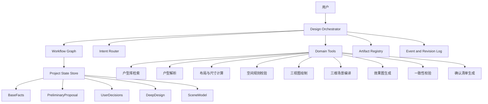
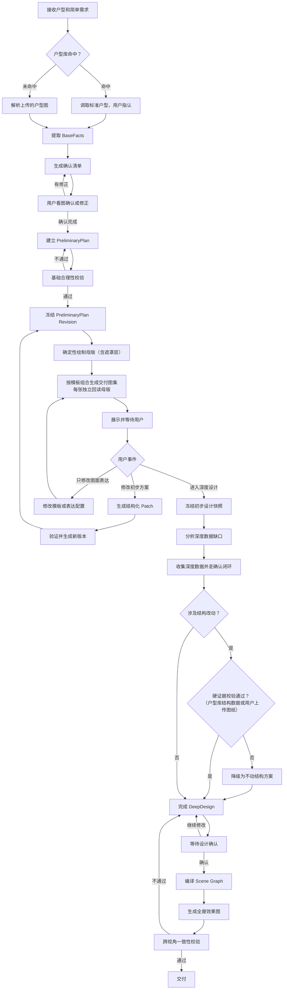

# 《是我的家》装修设计 Agent 架构方案 V1.3

> 版本：V1.3
> 日期：2026-08-22
> 文档性质：产品与 Agent 总体架构基线
> 设计范围：从初步设计建立信任，到深度设计完成全屋效果图的完整链路；不按 MVP 缩减范围。

## V1.3 变更记录

**本版两条核心裁决：**

**其一，系统中不存在"人工介入"概念**（人审、人工复核、转人工全部移除）。用户侧收集并确认信息（确认闭环），其余全部是系统自身逐步完善的问题——质量缺陷的唯一出路是迭代系统，不是加人工环节。

**其二，设计只面向"把系统做好用"，不面向"出了问题算谁的"**。全文清除责任划分类论证（"责任归属""免责""声明"）；产出性质在入口服务声明中一次性说明，交互过程与交付物中不出现任何免责文案，此后责任话题不再进入设计讨论。

具体回改：

1. **结构类信息路径由三条收敛为两条**：默认不动结构 / 硬证据（机器可校验）。"人工复核"路径删除。结构数据的系统性正解是**户型库**：每个户型的结构信息在库侧做准一次（原始图纸、硬证据沉淀），服务该户型全部用户——迭代方向是把库做准，不是每单向用户要证据。见 §8.3、§9.1。
2. **认知状态 `verified` 的定义修订**：由"深度设计复核"改为"深度设计阶段经实测或硬证据核验"——核验主体是数据，不是人。见 §8.1。
3. V1.1 变更记录第 4、6 条中的"人工复核""责任边界"表述由本版废止（保留原文作历史记录）。
4. 质量保障机制（替代人审）：约束优先于检查（确定性母版、模板槽位、默认不动结构）、人的判断移到设计时（模板上线一次性验收，运行时逐张实例不过人眼）、校验交给有动机的当事人（确认闭环、一键换一张、下单前量房）、有自动 oracle 的检查全部机检。
5. 交付图不再逐张携带"概念方案·尺寸以实测为准"落款（属免责文案，违反其二）；保留的是数据诚实展示规则：`inferred` 值带"约"、风格图不出现精确尺寸——这两条服务于用户理解，不是免责。

## V1.2 变更记录

依《架构对齐-设计Agent×技术架构》V1.2 回改：

1. **三张图从"严格信息子集递进"修订为"母版 + 模板库组合"**（§4、§10）：确认闭环已承担原图一的信任职责，交付图集的组合与顺序改为运营配置（当前默认：温暖奶油之家 → 功能说明图 → 彩铅生活草图，来自《第一阶段视觉提案与 Prompt 说明》）。
2. §5.3 Domain Tools 表补充物理落点列（对应对齐文档的服务与 activity 映射）。
3. §5.2 Intent Router 前置输入归一化层（语音转文字、多消息聚合），适配 IM 主通道形态。
4. §13 失效传播补充渲染两档规则（preview / final）。
5. §3.1 吸收《视觉提案》的用户心理路径与分享取舍原则。
6. §16 待定项按已定结论收敛。

## V1.1 变更记录

在 V1 基础上，本版本落实以下结论：

1. **户型获取主路径改为户型库优先**。用户输入小区名和户型编号，优先从户型库调取标准户型图；上传图片解析降级为"库中没有"时的备用路径。
2. **新增信息确认闭环**。系统提取信息后必须生成确认清单，用户以"看图点错"方式确认或修正；只有确认后的信息才能作为设计依据。见 8.2 节。
3. **新增比例锚定步骤**。用户提供或确认一个已知实际尺寸，用于校准全屋比例推算。
4. **明确数据信任与责任边界**。尺寸类数据确认后视为真，责任归属清晰；结构类数据不采信用户口头信息，必须走硬证据、不动结构或人工复核三条路径之一。见 8.3 节。
5. **Workflow Graph 增加确认节点与结构信息门**。见 9.1 节。
6. 设计师人工复核在"涉及结构改动的方案"上从待定项升级为强制项。见第 16 节。

## 1. 文档目标

本方案定义"是我的家"装修设计 Agent 的完整工作方式：

1. 用户提交户型（户型库调取或上传原始户型图）和少量家庭信息。
2. 系统提取信息并与用户完成确认闭环。
3. Agent 基于同一套初步方案，生成母版与模板化交付图集（默认三张）。
4. 确认闭环与交付图集共同建立专业感与基础信任：确认环节保证"AI 理解了房子"，交付图集提供吸引力、生活想象与轻量获得感。
5. 用户认可后，系统再进入独立的深度设计阶段。
6. 深度设计阶段补充准确空间数据和详细设计需求。
7. 最终设计被编译成统一的三维住宅场景，并生成全屋一致的效果图。

核心链路为：

```text
户型获取（户型库优先）与简单需求
→ 信息提取与用户确认
→ 一套初步方案
→ 母版与模板化交付图集
→ 用户认可并进入深度设计
→ 深度数据收集、确认与设计
→ 完整三维住宅
→ 全屋效果图
```

## 2. 前期争议点与最终结论

| 争议点 | 曾经出现的错误理解 | 最终结论 | 对架构的影响 |
|---|---|---|---|
| 当前讨论的主题 | 将问题理解成"效果图转 CAD" | 当前讨论的是装修设计 Agent 如何先输出三张户型图，再完成深度设计和效果图 | CAD 不进入主流程，只能作为未来可选交付格式 |
| 三张户型图的关系 | 将三张图理解为三个可比较、三选一的装修方案 | 三张图是一套初步方案的三层递进表达，不是三个方案分支 | 只生成一个 `PreliminaryPlan`，三张图是同一版本的三个视图 |
| 三张图的内容 | 方案 A、B、C 分别采用不同布局 | 图一为基本布置，图二为布局规划表现，图三为生活氛围感规划 | 三张图共享相同空间、家具和尺寸，不允许在绘图阶段修改布局 |
| 初步尺寸的意义 | 初步阶段需要完成严谨尺寸和完整空间分析 | 初步展示少量关键尺寸，用于建立专业感和信任，不进行深度分析 | 尺寸必须标注来源和精度，推算值必须显示"约"或 `≈` |
| 效果图的数据来源 | 可以根据初步户型图直接猜测效果图所需数据 | 效果图需要的数据在深度分析阶段收集、设计和确认 | 初步设计阶段不创建正式三维场景，不生成正式效果图 |
| 阶段划分 | 初步设计和深度设计在同一阶段完成 | 两个阶段必须明确分开，初步设计的任务是用简单方式建立基础信任 | Workflow Graph 设置明确阶段门，未经用户同意不得进入深度设计 |
| 产品完整度 | 以 MVP、单房间或局部试验作为目标 | 当前方案讨论完整产品结构，不做 MVP 范围缩减 | 架构覆盖初步设计、深度设计、全屋场景和全屋效果图完整链路 |
| Graph 的使用 | 将所有流程、数据和场景塞入一张大 Graph | 使用 Workflow Graph 管流程，版本化 Project State 管设计数据，Scene Graph 管三维场景 | Graph 按职责分层，不将 Graph 当成所有数据的唯一表达方式 |
| 烂图解析能力（V1.1 新增） | 需要先测试解析准确率，再决定是否支持低质量图片 | 低质量图片必须支持，不单独立项测试；用"户型库主路径 + 确认闭环"兜住解析误差 | 户型库成为主路径，上传解析为备用路径；解析结果必须经用户确认才进入设计 |
| 用户数据可信性（V1.1 新增） | 用户提供的信息经逻辑校验通过即视为真 | 尺寸类信息经用户确认后视为真、即为设计依据；结构类信息用户确认也不采信，只走硬证据或不动结构（V1.3：人工复核路径删除，结构数据在户型库侧沉淀做准） | 数据按"尺寸类 / 结构类"分轨处理，见 8.3 节 |
| 确认环节的位置（V1.1 新增） | 提取 BaseFacts 后直接建立初步方案 | 提取与设计之间必须有确认闭环：系统提问、用户看图确认、确认后才设计 | Workflow Graph 在 BaseFacts 之后增加确认节点，见 8.2 与 9.1 节 |
| 三张图的递进关系（V1.2 修订） | 三张图必须严格信息子集递进（图一⊂图二⊂图三），图一以素布置图建立第一层信任 | 确认闭环已承担"AI 理解了房子"的信任职责；交付图集改为绑定同一 Revision 的模板库组合，可用情绪图打头（视觉提案实证） | §4、§10 修订为母版+模板库；组合与顺序为运营配置 |

## 3. 产品阶段划分

### 3.1 阶段一：初步设计

#### 目标

用尽量少的信息和尽量清晰的视觉表达，让用户确认：

- 系统理解了原始户型。
- 系统理解了家庭的基本组成和核心诉求。
- 家具比例和空间关系具备基本常识。
- 方案具有一定专业感，值得继续深入设计。

交付图集的产品原则（吸收自《视觉提案》）——用户心理路径：

```text
认出自己的家 → 想象自己住进去 → 感觉是为我设计的 → 得到一个可复述的新发现 → 愿意保存或分享
```

其中"认出自己的家"由确认闭环（§8.2）提前完成。取舍原则：`分享意愿 ≈ 个性化 × 新发现 × 审美完成度 × 身份表达 ÷ 阅读负担`——信息不是越多越好，关键是"我懂了、我想存、我想给别人看"。

#### 户型获取的双路径

- **主路径：户型库调取。** 用户输入小区名和户型，系统从户型库返回标准户型图供用户指认。国内楼盘户型高度标准化，命中后无需解析，比例和结构数据直接可信。
- **备用路径：上传图片解析。** 户型库未命中时，用户上传户型图（含翻拍、截图、手绘等低质量图片）。解析结果不直接进入设计，必须先走 8.2 节的确认闭环。

#### 最小必要输入

这里的"最小必要"是为了降低初次沟通负担，不代表缩减完整产品范围。

- 户型（户型库指认，或上传原始户型图）。
- 一个比例锚点：用户提供或确认一个已知实际尺寸（如入户门宽、某面墙实测长度），用于校准推算比例。
- 家庭结构。
- 一至三个核心诉求。
- 用户明确提出的不可接受项。
- 原图中可识别的尺寸信息。

初步阶段不要求用户一次性提交完整现场测量、设备型号、材料型号和施工资料。

#### 核心数据

初步阶段形成一个轻量但结构化的 `PreliminaryPlan`：

```text
PreliminaryPlan
├── 原始空间轮廓
├── 基础比例与尺寸证据
├── 房间功能
├── 核心家具布置
├── 功能分区
├── 主要生活动线
├── 家庭活动场景
└── 初步氛围表达
```

`PreliminaryPlan` 只能建立在经用户确认的 BaseFacts 之上（见 8.2 节）。

### 3.2 阶段二：深度设计

#### 进入条件

用户看完初步设计交付图集后，明确选择"进入深度设计"。

系统不得仅根据浏览、停留时间或一般反馈，自动推断用户已进入深度设计。

#### 目标

- 将初步方案中的推测、建议和方向转化为经过确认的设计。
- 收集生成完整设计和效果图所需的数据。
- 完成空间、家具、柜体、材料、灯光和设备设计。
- 建立统一三维住宅场景。
- 生成与最终设计一致的全屋效果图。

#### 深度数据

- 现场精确尺寸。
- 承重墙、梁柱、烟道、管井等结构信息（按 8.3 节结构类数据规则处理）。
- 门窗高度、层高、朝向和采光信息。
- 家庭成员详细生活习惯。
- 物品类型、数量和收纳需求。
- 家电、设备和固定家具需求。
- 预算、改造边界和优先级。
- 材料、色彩、灯光和软装偏好。

深度数据不应一次性机械询问，而应根据当前设计缺口和下一项交付需要进行针对性收集；每一批收集到的数据同样必须经过 8.2 节的确认闭环，确认后才能作为设计依据。

## 4. 初步设计交付图的定义（V1.2 修订：母版 + 模板库组合）

交付体系分两层：

```text
母版（确定性绘制，绑定 PreliminaryPlan Revision，唯一几何真源）
└── 交付图集：N 张模板化视图，每张独立回读母版生成
```

- **母版**由确定性二维绘制管线（plan-2d-render）产出，同一管线先画 BaseFacts 识别结果作确认闭环底图，方案冻结后画 PreliminaryPlan 成母版；除 PNG 外输出房间遮罩与墙体图层，供生成条件控制和确定性 QA。
- **交付图集**默认三张（温暖奶油之家 → 功能说明图 → 彩铅生活草图），组合与顺序是运营配置而非架构约束；情绪图可以打头，因为"AI 没理解错房子"的信任已由确认闭环建立。
- 下文 4.1–4.3 定义三个**标准信息层**（布置层/规划层/生活层，沿用原图一/图二/图三的内容定义），模板从信息层中选取组合。

### 4.1 布置层（原图一：基本布置图）

回答：这个家大概怎么布置？

主要内容：

- 原始户型轮廓。
- 房间名称。
- 床、沙发、餐桌、书桌等核心家具。
- 家具与空间的基本比例。
- 房间面积或关键开间。
- 少量关键家具和通道尺寸。

图一负责建立第一层专业感：Agent 没有误解房子，家具基本放得下，空间关系基本合理。

### 4.2 规划层（原图二：布局规划表现图）

回答：为什么这样安排？

在图一基础上增加：

- 动区、静区、公共区和私密区。
- 家庭成员与空间的使用关系。
- 入户、家务、访客、起居等主要动线。
- 收纳位置和重点功能区。
- 空间之间的连接关系。
- 简洁的规划说明。

图二不能重新生成布局，只能解释和强化图一已经确定的空间逻辑。

### 4.3 生活层（原图三：生活氛围感规划图）

回答：一家人在这里会怎样生活？

在图二基础上增加：

- 阅读、陪伴、用餐、休息、学习等生活活动。
- 人物与空间的使用场景。
- 初步色彩倾向。
- 家具与软装气质。
- 光线和空间感受。
- 重点生活瞬间的简洁叙述。

图三不是正式效果图，也不承担材料定型、灯光计算或施工表达。它是在同一户型布局上增加生活叙事和氛围理解。

### 4.4 交付图集的统一约束

- 母版与所有交付图必须绑定同一个 `PreliminaryPlan Revision`。
- **每张交付图独立回读母版生成**，禁止以上一张生成图作为几何依据（防漂移，视觉提案实证规则）。
- 房间边界、门窗和核心家具坐标在所有图中与母版一致（遮罩比对可量化校验）。
- 模板只能增加表达层，不能修改设计层。
- 风格交付图不出现精确尺寸；近似尺寸只出现在母版上并标注"约"（V1.3：取消逐张落款文案，数据诚实展示规则保留——它服务于用户理解）。
- 如果发现布局需要修改，必须返回 `PreliminaryPlan` 生成新版本，重绘母版后再重新生成交付图集。
- 任意一张图都必须能追溯到使用的数据、模板版本和方案版本。

## 5. 总体 Agent 架构



### 5.1 Design Orchestrator

唯一的主编排 Agent，负责：

- 理解用户当前意图。
- 判断用户处于初步设计还是深度设计。
- 读取项目状态。
- 选择下一项工具或工作流节点。
- 将用户反馈转成结构化修改请求。
- 向用户解释结果、缺失信息和下一步。

不建议让多个自由发挥的大模型分别生成交付图。所有交付图必须由同一项目状态、同一方案版本和同一母版派生。

### 5.2 Intent Router

前置一层**输入归一化**（V1.2 新增）：IM 主通道的输入比表单脏——语音、短时间内连发多条、混合意图、转发的图片。归一化层做语音转文字、短时间窗多消息聚合成一个意图单元，归 design-svc（渠道层不理解语义）。

归一化后，负责区分用户反馈的类型：

- 修改户型或家具布置。
- 修改图面表达方式。
- 补充家庭需求。
- 补充尺寸证据。
- 回应确认清单（确认或修正提取的信息）。
- 询问设计原因。
- 进入深度设计。
- 修改深度设计。
- 修改效果图风格或视角。

不同意图必须路由到不同对象，避免用户说"颜色太重"时，系统错误修改房间布局。

### 5.3 Domain Tools

大模型不直接承担所有专业计算。

| 能力 | 主要责任方 | 物理落点（见对齐文档） |
|---|---|---|
| 理解家庭诉求、解释设计、识别反馈意图 | Agent | design-svc（LLM 经 LiteLLM，Langfuse 记成本） |
| 户型库检索与匹配 | 户型库工具 | estate-svc |
| 户型图视觉识别 | 户型解析工具 | genpipe activity: floorplan-parse |
| 识别信息缺口、生成确认清单 | 确认清单工具与 Agent 联合完成 | design-svc + Temporal workflow 节点 |
| 尺寸、碰撞、通道、边界闭合 | 几何与规则工具 | genpipe activities: plan-layout-solve / plan-rule-check |
| 母版与确定性图层绘制 | 二维绘图工具 | genpipe activity: plan-2d-render |
| 风格化交付图生成 | 生成模型 + 模板库 | genpipe activity: atmosphere-visual |
| 三维空间构建 | Scene Compiler | genpipe activity: scene-compile |
| 写实化和视觉氛围 | 效果图生成模型 | genpipe activities: base-render / realism-pass |
| 户型与效果图一致性 | 校验工具与 Agent 联合完成 | genpipe activity: consistency-check |

基本原则是：

> Agent 决定设计意图，结构化状态保存设计，确定性工具保证空间关系，生成模型负责视觉表现。

## 6. Graph 的职责与设计原则

### 6.1 Workflow Graph

负责管理阶段、分支、循环、暂停和恢复。

它回答：

- 现在处于哪个阶段？
- 下一步应该执行什么？
- 是否需要等待用户？
- 用户反馈需要返回哪个节点？
- 哪些产物需要重新生成？

### 6.2 Design Relation Graph

它是 `Project State` 内部的空间与生活关系模型，回答：

- 哪个家具位于哪个空间？
- 哪个空间服务哪项家庭需求？
- 哪条动线经过哪些空间？
- 哪个生活场景发生在哪里？
- 哪个尺寸约束了哪些对象？

主要实体包括：

```text
House
Space
Boundary
Opening
FurniturePlacement
Zone
Circulation
Person
Need
Activity
AtmosphereHint
```

典型关系包括：

```text
Space contains FurniturePlacement
Space adjacent_to Space
Opening connects Space
Person uses Space
Space supports Activity
Circulation passes_through Space
Need motivates Proposal
Dimension constrains Geometry
```

并不是所有属性都必须成为 Graph 节点。只有满足以下条件之一的对象才适合作为独立节点：

- 需要被多个对象引用。
- 需要独立修改。
- 需要独立失效和重新计算。
- 需要保留来源、版本或解释链。

颜色值、简单描述和单一尺寸通常可作为对象属性；当一个尺寸同时约束多个对象或具有多个证据来源时，再提升为独立对象。

### 6.3 Scene Graph

Scene Graph 只在深度设计确认后创建，负责三维空间：

```text
HouseScene
├── Room
│   ├── Wall
│   ├── Opening
│   ├── Ceiling
│   ├── FixedFurniture
│   ├── LooseFurniture
│   ├── Material
│   └── Light
└── Camera
```

所有效果图视角必须读取同一 Scene Graph，避免不同视角中的门窗、家具、材质和空间关系漂移。

### 6.4 不建立一张大 Graph

Workflow Graph、Design Relation Graph 和 Scene Graph 在概念上分层。物理实现可以使用：

- 带类型约束的 JSON。
- 关系型数据表。
- 邻接关系表。
- 版本和事件记录。

是否使用专门的图数据库属于后续技术选型，不是建立 Graph 设计原则的前提。

## 7. 项目状态模型

```text
ProjectState
├── projectId
├── phase
├── BaseFacts
├── PreliminaryProposal
├── UserDecisions
├── DeepDesign
├── SceneModel
├── OpenQuestions
├── ArtifactRegistry
└── RevisionLog
```

### 7.1 BaseFacts

保存原始资料中可以观察或确认的事实：

- 原始户型轮廓。
- 门窗位置。
- 原图尺寸。
- 原始图片证据。
- 户型库命中记录（如适用）。
- 比例锚点。
- 用户明确提供的家庭信息。
- 确认闭环产生的确认记录（谁在何时确认了哪些字段）。

BaseFacts 原则上不可被设计方案覆盖。发现错误时，应通过新证据和修订事件更正。

### 7.2 PreliminaryProposal

保存初步阶段的设计建议：

- 房间功能。
- 家具基本布置。
- 推算尺寸。
- 功能分区。
- 主要动线。
- 生活活动和氛围表达。

### 7.3 UserDecisions

保存用户已经做出的决定：

- 确认清单的确认与修正结果。
- 认可的设计方向。
- 明确否决的建议。
- 指定保留的空间或家具。
- 是否进入深度设计。
- 深度设计中的确认结果。

### 7.4 DeepDesign

保存经过深度分析、详细设计和用户确认的数据。

初步设计不能直接覆盖或冒充 DeepDesign。

### 7.5 ArtifactRegistry

记录所有对用户展示的产物：

- 确认清单与确认底图。
- 母版与初步设计交付图集。
- 深度设计图。
- 场景预览。
- 正式效果图。
- 解释文本和问题清单。

每个产物必须绑定生成它的项目版本、视图规范和依赖对象。

## 8. 事实、推测、建议与确认

### 8.1 认知状态

所有关键数据都必须带认知状态：

```text
observed       原始资料直接可见
inferred       AI根据比例或上下文推算
proposed       AI提出的设计建议
user_confirmed 用户确认
measured       现场测量
verified       深度设计阶段经实测或硬证据核验（核验主体是数据，不是人）
```

示例：

```json
{
  "targetId": "space-living-room",
  "property": "width",
  "value": 4200,
  "unit": "mm",
  "status": "inferred",
  "source": "source_plan_scale",
  "confidence": 0.76,
  "stage": "preliminary"
}
```

展示规则：

- `observed`、`user_confirmed`、`measured` 可以按相应来源正常展示。
- `inferred` 必须使用"约"或 `≈`。
- 无法建立合理比例时，不输出伪精确毫米数。
- 进入深度设计后，关键 `inferred` 数据必须被补充或验证。

### 8.2 信息确认闭环

系统的信任策略是：**不赌解析得准，也不赌用户报得准，赌"确认过的信息"。** 确认的目的只有一个：让进入设计的数据是对的——对的输入才有对的方案。

闭环流程：

```text
提取信息（户型库调取 / 图片解析 / 用户提供）
→ 标注每项信息的认知状态与把握程度
→ 生成确认清单
→ 用户看图确认或修正
→ 关键字段升级为 user_confirmed
→ 设计只引用确认后的关键信息
```

三条执行规则：

1. **系统必须知道自己哪里没把握。** 确认清单来自两类字段：认知状态为 `inferred` 的字段，以及对设计影响大的字段（比例、房间功能、是否涉及动墙）。把握充分且影响小的字段不进清单，避免问卷化。真正需要防的不是"解析失败"，而是"解析错了但系统不知道错了"——错误信息静默流入交付图集，会把建立信任变成摧毁信任。
2. **确认方式是"看图点错"，不是"读题答题"。** 系统把理解结果画回户型图上（"我认为这是主卧，宽约 3.6 米"直接标注在图上），用户扫一眼，点错的项当场修正。不采用长问答形式。
3. **交叉校验优先于逻辑校验。** 解析出的图面比例与用户提供的尺寸是两个独立来源：偏差小则双方可信度上升；偏差大则说明其中一方有错，只需针对该项追问。逻辑校验（面积加总、边界闭合）作为兜底，用于拦截内部矛盾。

确认闭环在两个阶段都生效：初步阶段确认 BaseFacts 关键字段；深度阶段每批收集到的数据同样先确认再使用。

### 8.3 数据信任分轨

用户提供的信息按两类分轨处理，不混用同一信任规则：

**尺寸类（房间长宽、层高、门窗大小等可测量数据）：**

- 必须由用户提供（实测或确认系统推算值）。
- 经确认闭环确认后视为真，作为设计依据。
- 认清该策略的边界：确认不能保证数值正确——用户把 3.85 米量成 3.58 米，单点校验无法发现。系统的应对全部是能力性的：①算术交叉校验（各房间尺寸合计 vs 户型总面积、门窗宽 vs 所在墙段长、与比例锚点互检），算得出矛盾的错误当场追问；②涉及定制柜体等毫米级交付时，下单前量房把数据升级为 `measured`——这是数据升级步骤，属于交易流程；③剩余误差靠迭代收敛：确认闭环的修正率、量房与自报值的偏差分布，都是解析与追问策略的直接评测信号。

**结构类（承重墙、梁柱、烟道、管井等结构信息）：**

- 不采信用户口头信息，用户确认也不采信。原因：用户不是不愿说，而是真不知道；猜一个答案不会与其他数据产生任何矛盾，校验无法发现。
- 只走以下两条路径之一（V1.3：原"人工复核"路径删除）：
  1. **默认不动结构**：设计不拆不改任何墙体，结构信息无需收集；
  2. **硬证据**：用户上传原始结构图或物业确认文件（机器可校验的证据），无法提供则回到路径 1。
- **结构数据的系统性正解是户型库（V1.3）**：每个户型的结构信息在库侧做准一次（开发商原始图纸、既有硬证据沉淀入库），服务该户型的全部用户。迭代方向是提高户型库结构数据的覆盖率与准确率，让"硬证据"越来越多地由库直接提供、越来越少地向单个用户索要——这就是"问题出现就迭代系统"在结构轨上的具体形态。

## 9. Workflow Graph

### 9.1 主状态流



### 9.2 主要事件

```text
PlanUploaded
PlanLibraryMatched
BasicRequirementProvided
ConfirmationListGenerated
FactConfirmed
FactCorrected
PreliminaryPlanGenerated
PreliminaryFeedbackReceived
PreliminaryPlanAccepted
DeepDesignRequested
DeepDataProvided
StructuralEvidenceProvided
DeepDesignConfirmed
RenderGenerated
RenderFeedbackReceived
```

流程由事件驱动，不能只依赖固定顺序。系统中断后，可以根据 Project State 和最后事件继续执行。

## 10. 交付图模板库与 ViewSpec（V1.2 修订）

信息层定义（模板的组合原料）：

```json
{
  "layers": {
    "basicArrangement": ["space", "boundary", "opening", "furniture", "keyDimension"],
    "layoutPlanning": ["zone", "circulation", "storageHint", "planningNote"],
    "lifestyleAtmosphere": ["person", "activity", "atmosphereHint", "lifestyleNote", "tipsPanel"]
  }
}
```

模板声明（示例，数据化存储、版本化、admin 运营可调）：

```json
{
  "templateId": "cream-journal",
  "name": "温暖奶油之家",
  "layers": ["basicArrangement", "layoutPlanning", "lifestyleAtmosphere"],
  "styleRef": "asset://style/cream-journal-v4",
  "voice": "owner-journal",
  "negativeRules": ["no-dimension-table", "no-corporate-wording", "no-extra-rooms"],
  "textCompose": "per-decision-10"
}
```

约束：

- 模板只能决定显示哪些信息层和如何表达，不能改变 `PreliminaryPlan`。
- 风格化生成必须使用母版的固定空间边界、家具位置和区域遮罩；生成结果改变户型结构或核心家具关系的，被一致性校验拒绝。
- 模板的文案口吻规则（屋主手账体、禁词表）约束 design-svc 的文案生成步骤；文字作为受控载荷下发，不由图像模型自由发挥。
- 默认交付组合与顺序是运营配置（当前默认：温暖奶油之家 → 功能说明图 → 彩铅生活草图）。

## 11. 用户反馈与结构化 Patch

Agent 不直接任意改写项目状态，而是先生成结构化 Patch。

例如用户提出：

> 书房不要双人位，只保留一个书桌，增加阅读角。

Agent 输出：

```json
{
  "intent": "replace_double_desk_with_reading_corner",
  "stage": "preliminary",
  "operations": [
    {
      "op": "remove",
      "targetId": "desk-02"
    },
    {
      "op": "add",
      "type": "furniturePlacement",
      "object": "reading-chair",
      "spaceId": "study"
    },
    {
      "op": "add",
      "type": "activity",
      "activity": "reading",
      "spaceId": "study"
    }
  ],
  "reason": "用户将书房目标调整为单人办公和阅读"
}
```

系统执行：

```text
Agent 生成 Patch
→ 检查当前阶段和修改权限
→ 进行几何与规则校验
→ 写入新的 PreliminaryPlan Revision
→ 计算受影响产物
→ 重绘母版并重新生成受影响交付图
```

高影响修改必须显式说明影响范围；例如初步阶段修改房间功能，会导致母版与全部交付图重新生成。

## 12. 深度设计与效果图生成

### 12.1 深度设计数据收集

系统根据设计目标和缺失字段生成问题，而不是直接展示一份固定长问卷。

例如：

- 需要设计整墙柜时，询问墙体准确宽高和主要收纳物。
- 需要设计厨房时，询问烟道、上下水、燃气和家电信息。
- 需要设计灯光时，询问层高、吊顶限制和生活场景。

数据收集遵循 8.3 节的分轨规则：尺寸类由用户提供并经确认闭环确认；结构类只走硬证据或不动结构路径。

### 12.2 生成链路

```text
已确认的 DeepDesign
→ 准确空间几何
→ 墙体、门窗和固定家具
→ 材料、灯光和设备
→ 完整 Scene Graph
→ 全屋相机规划
→ 基础三维渲染与控制信息
→ 写实效果图生成
→ 户型与跨视角一致性校验
```

效果图系统需要读取：

- 三维几何。
- 相机参数。
- 深度图。
- 线稿或边缘图。
- 对象和区域遮罩。
- 材质定义。
- 灯光定义。
- 设计风格说明。

图片生成模型负责真实感、材质表现和氛围，不得重新决定墙体、门窗和核心家具位置。

### 12.3 效果图一致性

必须检查：

- 效果图是否符合最终户型。
- 同一房间不同视角的门窗和家具是否一致。
- 相邻房间之间的连接是否一致。
- 全屋材料和设计语言是否一致。
- 用户修改深度设计后，相关旧效果图是否已经失效。

## 13. 版本、依赖与失效

每个产物记录依赖关系：

```json
{
  "artifactId": "preliminary-cream-journal-r7",
  "templateId": "cream-journal",
  "templateVersion": 3,
  "projectRevision": 7,
  "dependsOn": [
    "space-living-room",
    "furniture-sofa-01",
    "circulation-entry-01"
  ]
}
```

修改传播原则：

- 修改表达风格：只重新生成相关视图。
- 修改家具位置：重新校验方案，重绘母版并更新交付图集。
- 修改房间边界：更新相关空间、动线、母版、交付图集及后续设计依赖。
- 深度阶段修改门窗：相关三维场景和能看见该门窗的效果图失效。
- 未受影响的空间和效果图不必全部重做。
- **渲染两档规则（V1.2 新增）**：失效后默认只重算 preview 档（快速低质，供会话内迭代反馈），final 档（正式出图）由用户显式请求或交付节点触发——避免每次 Patch 都触发全量正式渲染导致成本与延迟失控。

## 14. 阶段边界

### 初步设计允许做

- 基础家具布置。
- 基础空间关系表达。
- 少量关键尺寸展示。
- 功能分区和主要动线说明。
- 生活活动和氛围表达。
- 基础合理性检查。

### 初步设计不承诺

- 施工级尺寸。
- 完整结构判断。
- 水电、暖通和设备设计。
- 柜体拆单和节点设计。
- 材料型号确定。
- 正式效果图的一致性和可施工性。

### 深度设计负责

- 对关键空间数据进行收集、确认和验证。
- 完成详细空间、家具、柜体、材料和灯光设计。
- 形成统一三维住宅。
- 生成并验证正式全屋效果图。

### 数据升级规则（V1.3 修订，原"承诺分级"）

- 自报尺寸进入设计前经算术交叉校验（房间合计 vs 总面积、门窗 vs 墙段、比例锚点互检），可检出的矛盾当场追问。
- 涉及定制柜体等毫米级交付的设计，下单前量房将相关尺寸升级为 `measured`（交易流程的数据升级步骤）。
- 涉及结构改动的设计，必须通过硬证据校验（户型库结构数据或用户上传图纸），否则降级为不动结构方案。

## 15. 方案验收标准

### 15.1 信息确认闭环（V1.1 新增）

- 认知状态为 `inferred` 的关键字段，未经确认不得作为设计依据。
- 确认清单只包含把握不足或高影响的字段，不得问卷化。
- 确认采用看图点错方式，用户的每次确认和修正都记录为事件。
- 任意设计产物可回溯到其依赖字段的确认记录。
- 结构类信息不存在 `user_confirmed` 即采信的路径，只能通过硬证据获得可用状态。

### 15.2 初步设计交付图集

- 母版与所有交付图绑定同一个 `PreliminaryPlan Revision`。
- 每张交付图独立回读母版生成，禁止以上一张生成图为几何依据。
- 核心空间、门窗、家具位置在所有图中与母版一致，可用遮罩比对量化校验。
- 模板只增加表达层，不修改设计层。
- 母版上的推算尺寸明确标注为近似值；风格交付图不出现精确尺寸。
- 不在初步阶段制造施工级精确性的错觉。
- 用户能理解交付图集是同一方案的不同表达，而不是多个备选方案。

### 15.3 Workflow Graph

- 任意节点可暂停和恢复。
- 用户反馈可以被正确路由到设计数据或表现视图。
- 未经用户明确同意不能进入深度设计。
- 每次修改产生新版本，并保留原因和来源。
- 失败重试不会重复写入或破坏已有状态。

### 15.4 深度设计和效果图

- 效果图数据来自已确认的深度设计，而不是初步户型图猜测。
- 所有效果图读取同一个 Scene Graph。
- 不同视角中的墙体、门窗、家具和材料保持一致。
- 用户修改设计后，系统能够准确识别并重做受影响产物。

## 16. 当前仍需后续确定的产品决策

以下内容不改变总体架构，但需要后续继续定义：

1. ~~三张初步设计图的具体视觉规范~~ **已部分定稿**：温暖奶油之家、彩铅生活草图由《视觉提案》定稿；功能说明图（规划层模板）视觉规范待定。
2. 母版上关键尺寸的数量和显示密度（风格交付图不显示尺寸，已定）。
3. ~~图三表现方式~~ **已收敛**：确定性绘制 + 生成式风格化组合；剩余为文字合成方式（对齐文档待拍板⑩：图像直出 vs 确定性排版叠加）。
4. 用户进入深度设计的具体交互入口和服务承诺。
5. 深度设计阶段的问题组织和交互节奏。
6. 全屋效果图默认覆盖的空间和视角规则。
7. ~~三维基础渲染与生成式写实化的技术组合~~ **已收敛**：Temporal + genpipe activities（scene-compile / base-render / realism-pass / consistency-check）；剩余为 realism-pass 具体模型选型。
8. 户型库的数据来源、覆盖率目标和维护方式。
9. 确认清单的字段数量上限与交互细节。

已在 V1.1 中决定、不再属于待定项的：

- ~~设计师人工复核~~（V1.3 废除）：系统中无人工复核节点。涉结构改动 = 硬证据机检（户型库结构数据优先），无证据则不动结构。
- 户型获取路径：户型库优先，上传解析备用。
- 信息进入设计的前提：经确认闭环确认。

## 17. 最终架构结论

本方案最终采用：

```text
一个 Design Orchestrator
+ 一个事件驱动的 Workflow Graph
+ 一个版本化的 Project State
+ 一个信息确认闭环
+ 母版与模板化交付视图
+ 独立的深度设计阶段
+ 深度设计后生成的 Scene Graph
+ 可追溯的产物与依赖系统
```

系统的信任基础是确认过的信息：户型优先从户型库调取，解析和用户自报的数据必须经用户看图确认后才进入设计；尺寸类数据确认后视为真，结构类数据只走硬证据或不动结构。在此之上，系统通过确认闭环与一套初步方案的模板化交付图集建立基础信任，再由用户主动进入深度设计。正式效果图必须建立在深度数据和已确认设计之上。Graph 的价值是控制阶段、保存关系、传播修改和保证一致性，而不是将所有数据与逻辑塞进一张复杂网络。
